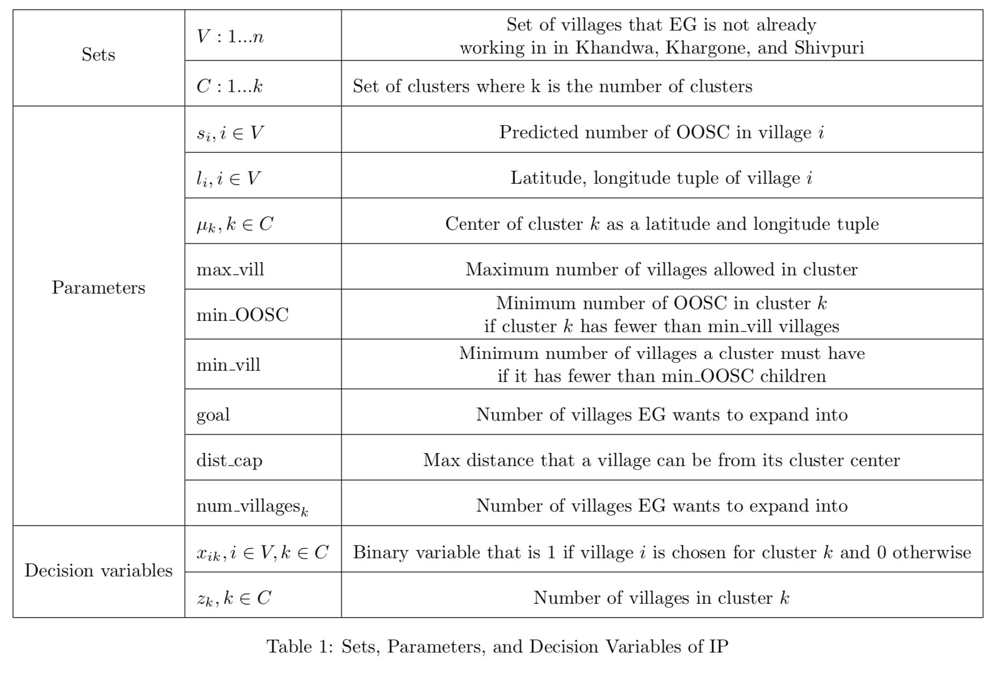
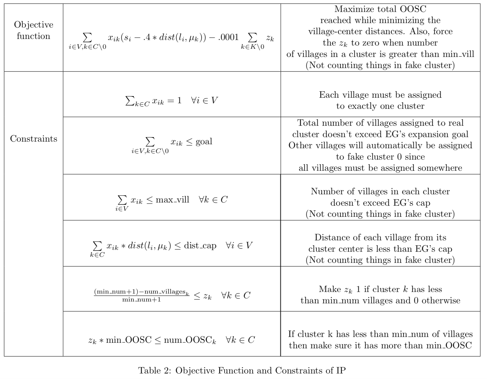
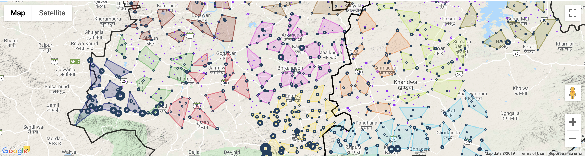

# Village selection and clustering algorithm
I built this algorithm to help an education NGO adapt the output of a machine learning model to match their operational constraints. The NGO works on finding and re-enrolling out of school children (OOSC) and the machine learning model was designed to help predict the number of out of school children present in villages across India so they could target areas with high unenrollment. To implement their program though, the NGO needs to assign field coordinators to clusters of villages (ie. villages need to be within ~15km to 5-6 other high impact villages). To help the NGO operationalize the out of school children predictions into a feasible targeting strategy, I built a customized second algorithm that identifies the optimal set of villages for expansion and clusters them for assignment to field coordinators. The algorithm uses a combination of unsupervised learning and integer programming (convex optimization) to select villages that both have lots of out of school children and are close to other villages with lots of out of school children. This is implemented in Systematic_postprocessing_run.py and Systematic_postprocessing_formulation.py. A series of postprocessing heuristics implemented in Systematic_postprocessing_formulation.py and Systematic_postprocessing_run.py help make the clusters equally sized. The output of this algorithm is then visualized in a series of interactive maps (see example screenshot below). 

These interactive maps were also used to help facilitate the codesign of the algorithm itself. By visualizing the output of different possible algorithm configurations I was able to understand the constraints and needs of the NGO, and tailor the algorithm around their experiences in the field.

## Algorithm formulation
The following outlines the mathematical formulation of the algorithm which I built. It is this formulation that I programmed in the Kmeans_IP_formulation.py script. Table 1 defines all variables and Table 2 outlines how they were formulated into an optimization function and constraints for the integer program.




## Dependencies
The selection and clustering algorithm and postprocessing scripts collectively require the following, all of which are available through pip and conda:
```pulp
random
argparse
numpy
pandas
matplotlib
geopy
math
sklearn
ipywidgets
gmaps
json
random
```

These scripts are compatible with all versions of Python 3. 


## Functionality details

### Kmeans_IP_formulation.py: 
This file contains the classes and functions necessary to run the initial clustering algorithm. It implements a modified K-means algorithm in which the cluster assignment step is an embedded integer program solved using the PuLP package. The algorithm is run using the **Kmeans_IP_run.py** file. The results of this algorithm are stored in the Excel files in the folder Excel_results/Kmean_IP. In addition, some graphs to help diagnose whether the algorithm is converging properly are saved to the Kmeans_functionality_figures folder.

### Systematic_postprocessing_formulation.py: 
This file contains the functions necessary to run a series of sequential postprocessing algorithms on the K-means/IP output and generate summary statistics of the clusters at each step. The postprocessing algorithms are run using the **Systematic_postprocessing_run.py** file. The results of these algorithms are stored in the Postprocessing and Renumbered subfolders of the Excel_results folder. Some basic summary statistics are printed to the console, while more detailed summary statistics are printed to each excel file which is saved in the excel_results folder. In addition, basic histograms are generated for each step of the postprocessing and saved in the stats_figures folder. *Note: The postprocessing_small_if_few() function in systematic_postprocessing_formulation.py should be modified to not exclude cluster 4 if this algorithm is run on new data.*

### Colored_by_block.ipynb: 
This jupyter notebook uses the gmaps python package to create an interactive Google Map with the clustering results plotted on top of it. Using the ipywidgets infrastructure, notebook exports the map as a .html file that is saved in maps/html_files. A legend of block colors and names is exported to maps/legends. 

**Guide to interpreting interactive maps:**


- Village markers are sized in proportion to the number of predicted OOSC. Purple markers represent unclustered villages and navy markers represent clustered villages we recommend the NGO expand into. Markers can be clicked to display a textbox with the village name, block name, and cluster ID.
- Polygons represent the outer border of clusters. Polygons are colored such that clusters in the same block are the same color.

	
**Important items to keep updated in Colored_by_block.ipynb:**
- **Dataframe being mapped:** This code is set up to currently map the final postprocessed results, but this can be changed by modifying the filepath indicated in the ipynb to load a different results dataframe from Excel_results. If you change the filepath also change the stage variable at the top of the notebook to reflect the postprocessing step you're mapping. This will modify the figure file name appropriately and allow the saving of multiple maps at once. If the same postprocessing stage is mapped multiple times, the map associated with that stage will be overwritten by the most recent map generated.
- **The districts being mapped:** The notebook prints two maps, one of Shivpuri district and another of the Khargone/Khandwa districts (combining the maps exceeds the capacity of the gmaps plotting package and creates html files that are very slow to load). To specify which map you'd like to generate, follow the instructions outlined at the top of the notebook.

**Important note on .html file size**: Each time the notebook is used to generate a .html map file, **restart the kernel**, otherwise the .html files become excessively large.
	
*Alternative mapping option*: To run a map which is colored to help diagnose clustering deficiencies, run the *Diagnostic_coloring.ipynb* file instead of the *Colored_by_block.ipynb*
